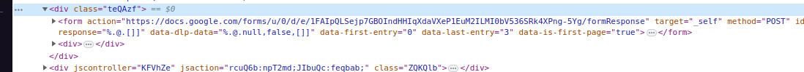
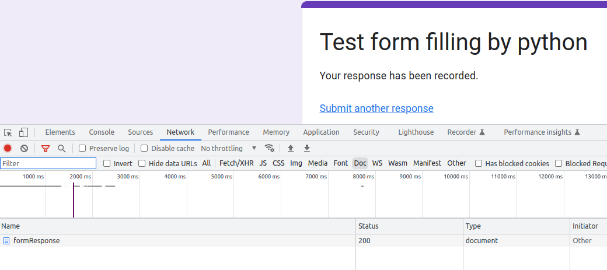
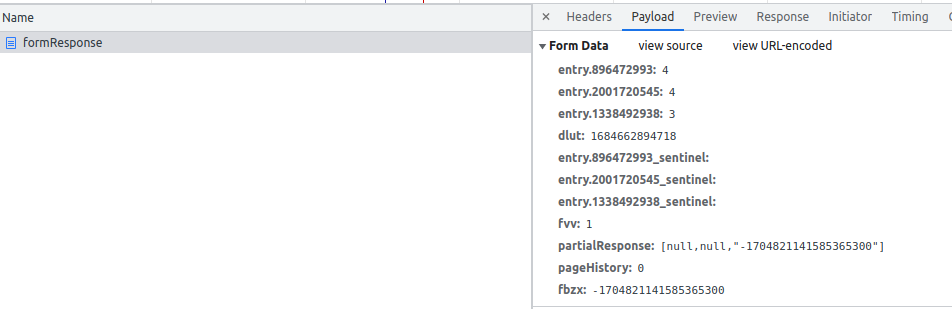

# GoogleForm_submission_python
Simple google form submission using python requests 

You have a google form, go to that form, open console, inspect element, find the \<form> element

Copy the url in the "action" property

That will be the url used in the script

Now find the name of the input element, still in element inspection, add the name of the input and value of your choie into the form_data in the script, this process can be tedious if there are many question in the form

The more efficient way is to open devmode in the form, go to network tab, fill in the form, send the form.

Inspect the formResponse, go to the payload

Only copy the entries line (no "_sentinel"), paste it to form_data, you can change the value 

form_data is a python dictionary holding each question and its value.

Run the form_submit.py script.

That's it.

